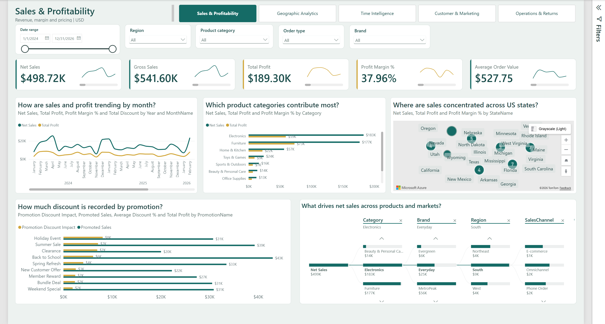
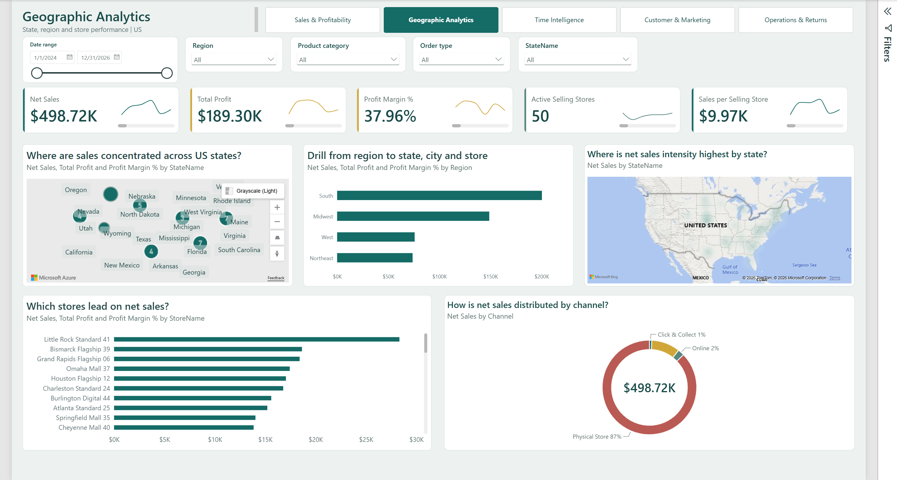
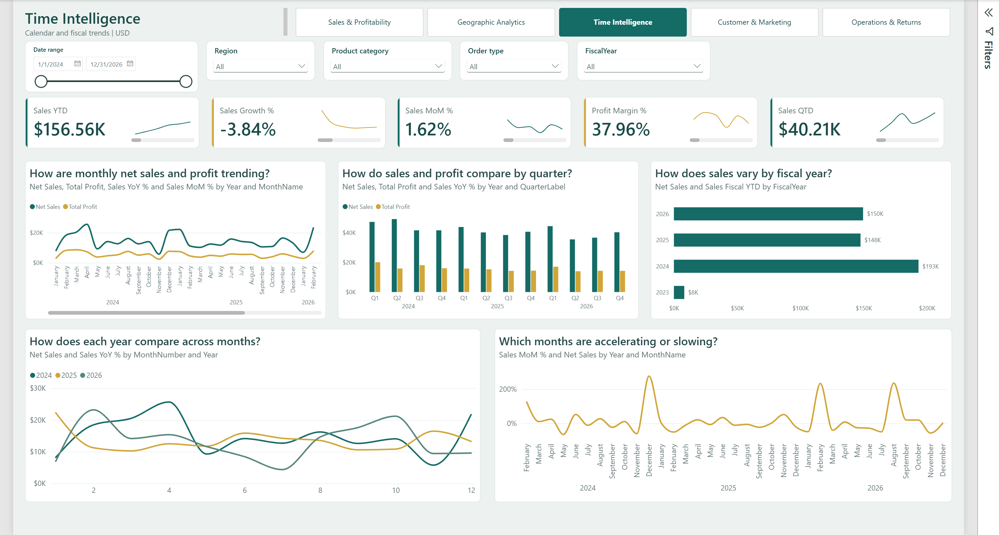
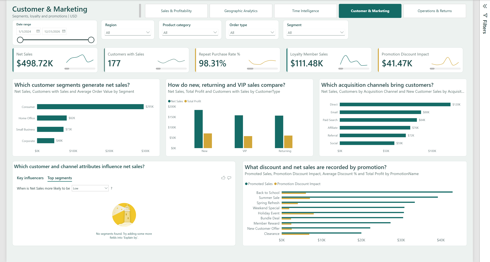
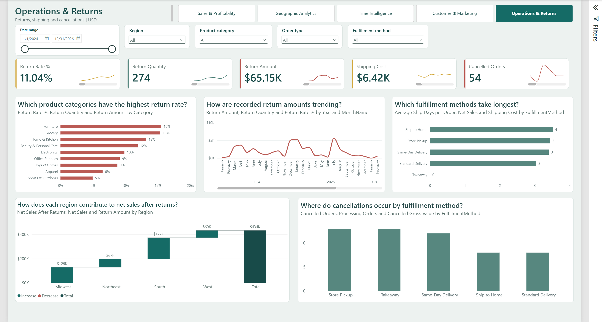

# Retail Analytics Portfolio

An executive-focused Power BI portfolio project built from a **fictional US
retail sample dataset**. The PBIP contains five report pages, an imported
star-schema semantic model, 45 explicit DAX measures, and a reusable Excel
workbook.

> **Publication status:** This is a local project package. It has not been
> published to Power BI Service or GitHub. There is no live online report link.
> The screenshots below are reviewed captures from Power BI Desktop, not a
> published or interactive web report.

## Contents

- [Project objectives](#project-objectives)
- [Report pages](#report-pages)
- [Sample-data snapshot](#sample-data-snapshot)
- [Tools and project files](#tools-and-project-files)
- [Data model](#data-model)
- [Screenshots](#screenshots)
- [Get the files and run locally](#get-the-files-and-run-locally)
- [Privacy, licensing, and usage](#privacy-licensing-and-usage)
- [Documentation](#documentation)

## Project objectives

- Give executives a consistent view of retail sales, profitability, customers,
  geography, time trends, operations, and returns.
- Use a fact-and-dimension model with explicit, reusable measures.
- Make the report inspectable and reusable as a Power BI Desktop project rather
  than claim it is an online interactive report.
- Keep sales before returns, recorded returns, and sales after returns distinct.

## Report pages

| Page | Focus | Page guide |
| --- | --- | --- |
| Sales & Profitability | Revenue, margin, product categories, discounts, and sales drivers | [Sales & Profitability](docs/report-guide.md#1-sales--profitability) |
| Geographic Analytics | State, regional, store, and channel comparisons | [Geographic Analytics](docs/report-guide.md#2-geographic-analytics) |
| Time Intelligence | Monthly, quarterly, year-over-year, and fiscal trends | [Time Intelligence](docs/report-guide.md#3-time-intelligence) |
| Customer & Marketing | Segments, customer type, acquisition, loyalty, and promotions | [Customer & Marketing](docs/report-guide.md#4-customer--marketing) |
| Operations & Returns | Returns, fulfillment, shipping, cancellations, and regional after-return sales | [Operations & Returns](docs/report-guide.md#5-operations--returns) |

The PBIR definitions use a 1920 × 1080 (16:9) canvas, page navigation, date
filters, and page-specific slicers. See the [report guide](docs/report-guide.md)
for visuals, questions, interactions, caveats, and design notes.

## Sample-data snapshot

The workbook's own ReadMe sheet identifies the data as fictional practice data.
The following figures were queried from the local Desktop semantic model with
the report filters at their default (unrestricted) selections. They describe
this sample snapshot only; they are not business claims or a live service
refresh.

| Measure | Sample result |
| --- | ---: |
| Gross Sales | $541,600.96 |
| Net Sales (before returns) | $498,720.39 |
| Total Profit | $189,302.72 |
| Profit Margin % | 37.96% |
| Distinct non-cancelled orders | 945 |
| Customers with sales | 177 |
| Return Amount | $65,149.25 |
| Return Quantity | 274 units |
| Unit Return Rate | 11.04% |
| Shipping Cost | $6,423.98 |

### Observations from the sample

- Electronics is the largest category by net sales ($183,140.64), while
  Furniture is close behind ($176,859.76) and has a higher sample margin
  (41.32% versus 32.35%).
- The South is the largest region by net sales ($200,292.70), followed by the
  Midwest ($148,782.75).
- New-customer-type sales are $183,970.32; VIP sales are $158,136.78; and
  Returning sales are $156,613.29. These are source classifications, not
  cohort-based retention or lifetime-value results.
- Net Sales After Returns is $433,571.14 in this sample snapshot
  ($498,720.39 net sales less $65,149.25 recorded return amount). Tax is
  separate.

All results are filter-dependent. The exact measure definitions and business
rules are in [DAX measures](docs/measures.md).

## Tools and project files

- Power BI Desktop and the PBIP/PBIR project format
- Power Query (M) for importing the Excel tables
- DAX for 45 explicit measures
- Excel workbook as the sample data source

```text
Retail Analytics.pbip
Retail Analytics.Report/       Report pages, visuals, navigation, and theme
Retail Analytics.SemanticModel/ TMDL model, measures, relationships, and M
data/Sales_Star_Schema.xlsx     Fictional/sample workbook
docs/                          Setup, data model, data dictionary, and DAX guide
screenshots/                   Reviewed report-page captures
```

The public-ready model copy uses `C:\RetailAnalytics\Sales_Star_Schema.xlsx`
as its workbook source so it does not expose the original workstation path.
Follow [local setup](docs/setup.md) before refreshing the model.

## Data model

`tblFactSales` is the transaction-line fact table. It relates to dimensions for
customer, customer type, date, device, loyalty status, order type, payment
method, product, promotion, sales rep, and store. Five dedicated measure
tables group the 45 measures by business area. The date dimension spans
2024-01-01 through 2026-12-31 and includes calendar and fiscal attributes.

See [model relationships](docs/data-model.md) and the
[data dictionary](docs/data-dictionary.md).

## Screenshots

These five captures were reviewed from the local Power BI Desktop report using
the included fictional/sample workbook. They show the report at its default
filter selections; values are illustrative and filter-dependent. No screenshot
is evidence of Power BI Service publication or online interactivity.

<details>
<summary>Sales &amp; Profitability</summary>

</details>

<details>
<summary>Geographic Analytics</summary>

</details>

<details>
<summary>Time Intelligence</summary>

</details>

<details>
<summary>Customer &amp; Marketing</summary>

</details>

<details>
<summary>Operations &amp; Returns</summary>

</details>

Known rendered limitations are documented in the
[report guide](docs/report-guide.md): the state intensity map currently shows
its basemap without a visible heat layer, and the Key Influencers visual reports
no segments found for the current sample context.

## Get the files and run locally

1. Download this repository as a ZIP or clone it after publication.
2. Follow [Power BI Desktop setup](docs/setup.md), including the workbook source
   path step.
3. Open `Retail Analytics.pbip` in Power BI Desktop and refresh the model.
4. Use the page navigator and slicers to explore the local report.
5. To share with stakeholders, publish from Desktop to an authorized workspace,
   configure credentials/refresh as appropriate, then share the Service report
   or distribute it through a Power BI app. See the
   [Power BI project deployment overview](https://learn.microsoft.com/power-bi/developer/projects/projects-overview).

Power BI Service sharing and licensing depend on the organization's workspace
capacity, viewer licenses, permissions, data-source credentials, and any row
security requirements. This repository does not grant access to a published
semantic model.

## Privacy, licensing, and usage

- The included workbook labels its records fictional/sample. It contains
  synthetic-looking customer and sales-representative names plus store/city and
  opt-in attributes. Do not replace it with real customer, employee, sales, or
  confidential business data before public distribution.
- Local Power BI cache and settings files are excluded from the package.
- No open-source license has been selected. Until the owner chooses one, the
  project is **all rights reserved**; viewing this repository does not grant
  permission to redistribute or adapt its files.
- No campaign ROI or customer lifetime value is claimed. Promotion discount
  measures report recorded discount spend, not causal lift.
- No live interactive report, public Power BI link, scheduled refresh, or
  Power BI Service deployment is claimed.

## Documentation

- [Report guide and analytical workflows](docs/report-guide.md)
- [Data model and relationships](docs/data-model.md)
- [Data dictionary](docs/data-dictionary.md)
- [DAX measures and definitions](docs/measures.md)
- [Power BI Desktop setup and refresh](docs/setup.md)
- [License and usage notice](LICENSE.txt)
