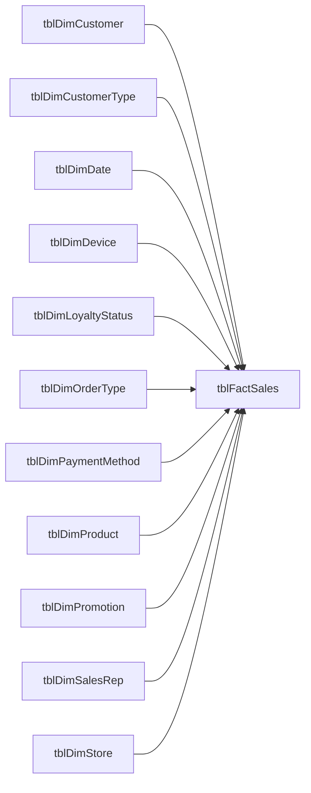

# Data Model

## Grain and shape

`tblFactSales` is at transaction-line grain. The sample workbook documents
1,000 rows with unique `TransactionID` values. An order can contain multiple
lines, so order counts use distinct `OrderNumber`, not line counts.

The model uses imported Excel tables arranged as a fact-and-dimension design.
The fact stores transaction IDs, dates, customer/product/store/promotion/sales
rep keys, order and fulfillment attributes, quantities, financial amounts,
return fields, and shipping duration.

## Relationship overview

The relationship file contains these 11 key joins. The dimension key is unique
on its side and filters matching fact rows in the report's star-schema
pattern.

| Fact foreign key | Dimension key |
| --- | --- |
| `tblFactSales[CustomerID]` | `tblDimCustomer[CustomerID]` |
| `tblFactSales[CustomerType]` | `tblDimCustomerType[CustomerType]` |
| `tblFactSales[DateKey]` | `tblDimDate[DateKey]` |
| `tblFactSales[DeviceType]` | `tblDimDevice[DeviceType]` |
| `tblFactSales[LoyaltyStatus]` | `tblDimLoyaltyStatus[LoyaltyStatus]` |
| `tblFactSales[OrderType]` | `tblDimOrderType[OrderType]` |
| `tblFactSales[PaymentMethod]` | `tblDimPaymentMethod[PaymentMethod]` |
| `tblFactSales[ProductID]` | `tblDimProduct[ProductID]` |
| `tblFactSales[PromotionID]` | `tblDimPromotion[PromotionID]` |
| `tblFactSales[SalesRepID]` | `tblDimSalesRep[SalesRepID]` |
| `tblFactSales[StoreID]` | `tblDimStore[StoreID]` |

The date dimension has daily records from 2024-01-01 through 2026-12-31 and
includes calendar and fiscal fields. `DateKey` is the related key; time
measures use the date dimension fields.

## Measure containers

Five calculated tables are dedicated measure homes. Each contains a hidden
blank placeholder column and no business-data rows:

| Measure table | Count | Focus |
| --- | ---: | --- |
| `_Sales Measures` | 11 | Revenue, profitability, discounts, orders |
| `_Geography Measures` | 6 | Store, region, state, and channel comparisons |
| `_Time Intelligence Measures` | 7 | Calendar and fiscal time calculations |
| `_Customer & Marketing Measures` | 11 | Segments, repeat purchasing, loyalty, promotions |
| `_Operations & Returns Measures` | 10 | Returns, shipping, cancellations, units |

There are 45 measures in total. See [DAX measures](measures.md) for formulas and
their interpretation.

## Source and refresh

Power Query reads named tables from `data/Sales_Star_Schema.xlsx`. The
public-ready copy points at `C:\RetailAnalytics\Sales_Star_Schema.xlsx` to avoid
embedding a developer-specific path. Follow [setup](setup.md) before refreshing
on another machine. No local Power BI cache or user settings are included.
